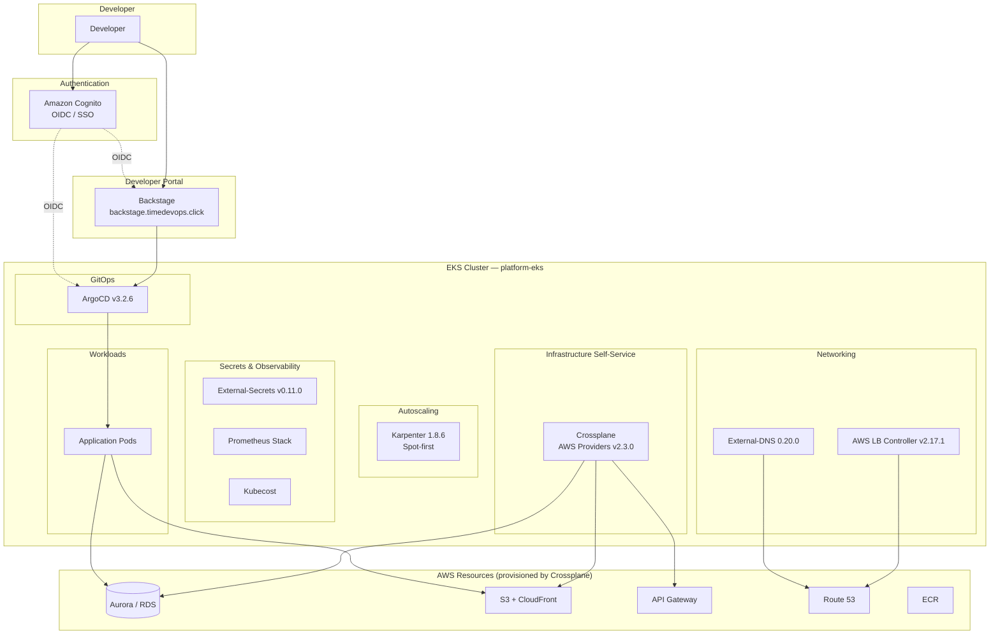

# IDP Platform — Internal Developer Platform on AWS

Production-grade Internal Developer Platform running on EKS. Developers get self-service infrastructure provisioning via Backstage + Crossplane, GitOps-driven deployments via ArgoCD, and a golden path for creating containerized microservices — all behind Cognito SSO.

**Region:** `us-east-1` · **Domain:** `timedevops.click` · **Cluster:** `platform-eks`

---

## Architecture



---

## Platform Components

| Component | Version | Purpose |
|-----------|---------|---------|
| EKS | 1.31 | Kubernetes control plane |
| Karpenter | 1.8.6 | Spot-first node autoscaling |
| ArgoCD | v3.2.6 | GitOps continuous delivery |
| AWS LB Controller | v2.17.1 | ALB/NLB ingress provisioning |
| External-DNS | 0.20.0 | Route 53 DNS automation |
| External-Secrets | v0.11.0 | Secrets management (AWS → K8s) |
| Crossplane + AWS Providers | v2.3.0 | Infrastructure self-service |
| Backstage | latest | Developer portal & templates |
| Kubecost | latest | Cost management & visibility |
| Prometheus Stack | latest | Monitoring & alerting |
| Amazon Cognito | — | SSO / OIDC authentication |

### Crossplane AWS Providers

All at `v2.3.0`: `provider-family-aws`, `aws-rds`, `aws-s3`, `aws-cloudfront`, `aws-ec2`, `aws-route53`, `aws-apigatewayv2`, `aws-secretsmanager`.

---

## Self-Service Capabilities (Crossplane XRDs)

Developers provision AWS infrastructure by creating claims — no Terraform or AWS console access needed.

| XRD | API | What It Provisions |
|-----|-----|--------------------|
| Aurora Database | `xauroras.platform.darede.io` | Aurora PostgreSQL or MySQL cluster with subnets, security groups, and parameter groups |
| Static Website | `xstaticwebsites.platform.darede.io` | S3 bucket + CloudFront distribution with OAC and custom domain |
| HTTP API | `xhttpapis.platform.darede.io` | API Gateway + Cognito authorizer + VPC Link to internal services |

### Compositions

| Composition | Description |
|-------------|-------------|
| `aurora-mysql` | Aurora MySQL cluster |
| `aurora-postgresql` | Aurora PostgreSQL cluster |
| `rds-mysql` | Standalone RDS MySQL instance |
| `rds-postgresql` | Standalone RDS PostgreSQL instance |
| `httpapi-cognito-vpclink` | HTTP API with Cognito auth and VPC Link |
| `static-website` | S3 + CloudFront static site |

---

## Golden Path: 3-Tier Application

When a developer creates an application through Backstage:

```
1. Backstage Template    → Scaffolds app repo (Node.js / Python / Go)
2. GitHub Repository     → Created with CI/CD workflow, Dockerfile, catalog-info
3. GitHub Actions CI/CD  → Builds image, pushes to ECR
4. GitOps Repo Updated   → K8s manifests + ArgoCD Application written
5. ArgoCD Sync           → Deploys pods, service, ingress to EKS
6. Crossplane Claims     → Provisions RDS + S3 + CloudFront as needed
7. External-DNS + LB     → Configures Route 53 DNS + ALB
8. App Live              → Accessible at <app>.timedevops.click
```

Each app gets: structured logging, Prometheus metrics (`/metrics`), health probes (`/health`, `/ready`), ServiceMonitor, and Backstage catalog entry with observability deep links.

---

## Repository Structure

```
id-platform-workspace/
├── terraform/
│   ├── vpc/                  # VPC, subnets, NAT Gateway
│   ├── eks/                  # EKS cluster, Karpenter IAM
│   ├── addons/               # Karpenter controller + NodePool
│   └── platform-gitops/      # ArgoCD, Cognito, LB Controller, External-DNS
├── argocd-apps/
│   └── platform/             # ArgoCD Application manifests
├── docs/                     # Architecture decisions, guides, reports
├── Makefile                  # Automation targets
└── README.md
```

---

## Terraform Stacks

All stacks use S3 backend with bucket `poc-idp-tfstate` and AWS profile `darede`.

| Stack | Purpose | State Key |
|-------|---------|-----------|
| `vpc` | VPC, subnets, NAT Gateway | `vpc/terraform.tfstate` |
| `eks` | EKS cluster, bootstrap nodes, Karpenter IAM | `eks/terraform.tfstate` |
| `addons` | Karpenter controller, NodePool, EC2NodeClass | `addons/terraform.tfstate` |
| `platform-gitops` | ArgoCD, Cognito, AWS LB Controller, External-DNS | `platform-gitops/terraform.tfstate` |

---

## Quick Start

### Prerequisites

- AWS CLI configured with profile `darede`
- Terraform ≥ 1.5
- kubectl
- make

### Install

```bash
make install
```

Runs in order: `apply-vpc` → `apply-eks` → `apply-addons` → `apply-gitops` → `configure-kubectl` → `validate`

### Destroy

```bash
make destroy
```

Runs in reverse: `destroy-gitops` → `destroy-addons` → `destroy-eks` → `destroy-vpc`

### Other Commands

```bash
make plan-all           # Plan all Terraform stacks
make validate           # Check cluster health (nodes, pods, Karpenter)
make validate-gitops    # Check ArgoCD, External-DNS, LB Controller, DNS
make configure-kubectl  # Update kubeconfig for platform-eks
make test-karpenter     # Test Spot node provisioning
```

---

## Access URLs

| Service | URL |
|---------|-----|
| ArgoCD | https://argocd.timedevops.click |
| Backstage | https://backstage.timedevops.click |
| Kubecost | https://kubecost.timedevops.click |

---

## Authentication

All platform UIs use **Amazon Cognito** as the OIDC identity provider.

- **SSO:** Single sign-on across ArgoCD, Backstage, and Kubecost
- **Admin group:** `argocd-admins` (full ArgoCD access)
- **Protocol:** OIDC with Cognito User Pool

---

## Phases

| Phase | Scope | Status |
|-------|-------|--------|
| Phase 0 — Bootstrap | VPC, EKS, Karpenter, ArgoCD, Cognito SSO, Backstage, External-Secrets | ✅ Complete |
| Phase 1 — Infra Self-Service | Crossplane AWS providers, XRDs, Compositions, self-service via Backstage | ✅ Complete |
| Phase 2 — App Scaffolding | Golden Path templates (Node.js, Python, Go), CI/CD, GitOps, observability | ✅ Complete |

---

## Documentation

See `docs/` for detailed guides:

- [STATE.md](docs/STATE.md) — Canonical platform state and decisions
- [GOLDEN-PATH-GUIDE.md](docs/GOLDEN-PATH-GUIDE.md) — How to use the Create Application template
- [CROSSPLANE-SUCCESS.md](docs/CROSSPLANE-SUCCESS.md) — Crossplane setup and validation
- [TROUBLESHOOTING.md](docs/TROUBLESHOOTING.md) — Common issues and fixes
