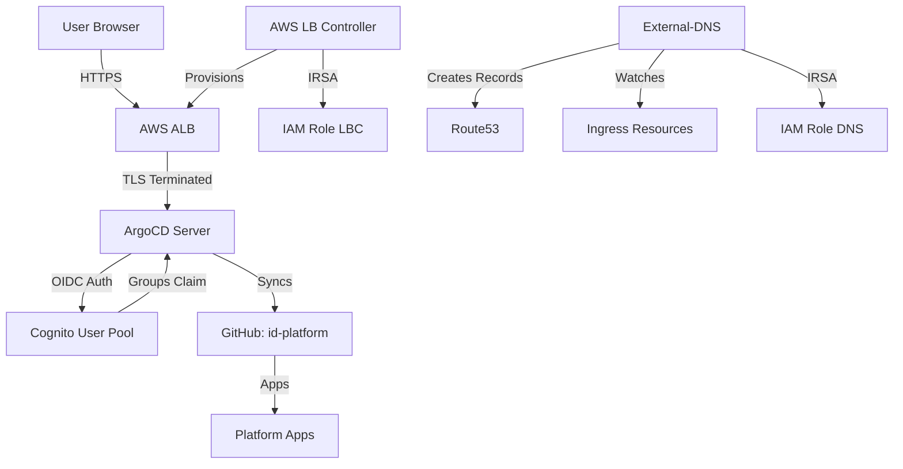

# Phase 0 - GitOps Implementation

## Overview

This document describes the GitOps foundation implementation for the Internal Developer Platform, including authentication (Cognito), ingress (AWS Load Balancer Controller), GitOps (ArgoCD), and DNS automation (External-DNS).

## Architecture



## Components

### 1. Amazon Cognito
- **User Pool:** `idp-poc-darede-cluster-user-pool`
- **OAuth Domain:** `idp-poc-darede.auth.us-east-1.amazoncognito.com`
- **Features:**
  - Email-based authentication
  - Password policy enforced (12+ chars, complexity)
  - MFA optional
  - Advanced security mode
  - Groups claim in ID token (`cognito:groups`)
  
**Admin Group:**
- Name: `argocd-admins`
- Maps to ArgoCD `role:admin`

### 2. AWS Load Balancer Controller
- **Version:** Helm chart 1.17.1
- **Namespace:** `kube-system`
- **Authentication:** IRSA (IAM Role for Service Account)
- **Features:**
  - ALB provisioning for Ingress resources
  - ACM certificate integration
  - High availability (2 replicas)
  - Pod disruption budget
  - Topology spread constraints

### 3. ArgoCD
- **Version:** Helm chart 9.3.5 (ArgoCD v3.2.6)
- **Namespace:** `argocd`
- **URL:** https://argocd.timedevops.click
- **Authentication:** AWS Cognito via Dex OIDC connector

**OIDC Configuration:**
```yaml
connectors:
- type: oidc
  id: cognito
  name: AWS Cognito
  config:
    issuer: https://cognito-idp.us-east-1.amazonaws.com/<pool-id>
    clientID: <client-id>
    clientSecret: <client-secret>
    redirectURI: https://argocd.timedevops.click/api/dex/callback
    scopes: [openid, profile, email]
    claimMapping:
      groups: cognito:groups
```

**RBAC Policy:**
```csv
g, argocd-admins, role:admin
policy.default = role:readonly
```

**High Availability:**
- Server: 2-5 replicas (autoscaling)
- Repo Server: 2-5 replicas (autoscaling)
- Controller: 1 replica
- Redis: Single instance (dev)

**Ingress Configuration:**
- ALB with ACM TLS termination
- External-DNS hostname annotation
- Health checks on `/healthz`
- SSL redirect enabled

### 4. External-DNS
- **Version:** Helm chart 1.20.0 (external-dns v0.20.0)
- **Namespace:** `external-dns`
- **Authentication:** IRSA with scoped permissions

**Configuration:**
- Provider: AWS Route53
- Sources: `ingress`, `service`
- Registry: `txt` (ownership tracking)
- TXT Owner ID: cluster name
- Policy: `upsert-only` (safer than sync)
- Domain filters: `timedevops.click`
- Zone ID filters: specific hosted zone

**IAM Permissions (Scoped):**
```json
{
  "Statement": [
    {
      "Effect": "Allow",
      "Action": [
        "route53:ChangeResourceRecordSets",
        "route53:ListResourceRecordSets"
      ],
      "Resource": "arn:aws:route53:::hostedzone/<zone-id>"
    },
    {
      "Effect": "Allow",
      "Action": "route53:ListHostedZones",
      "Resource": "*"
    }
  ]
}
```

### 5. App-of-Apps Pattern
- **Application Name:** `platform-apps`
- **Repository:** https://github.com/matheusmaais/id-platform
- **Branch:** `main`
- **Path:** `argocd-apps/platform/`
- **Sync Policy:** Automated (prune + self-heal)

## Deployment

### Prerequisites

1. **Infrastructure deployed:**
   - ✅ VPC (`terraform/vpc`)
   - ✅ EKS 1.31 (`terraform/eks`)
   - ✅ Karpenter (`terraform/addons`)

2. **DNS and certificates:**
   - ✅ Route53 hosted zone: `timedevops.click`
   - ✅ ACM certificate: `*.timedevops.click`

3. **AWS Load Balancer Controller IAM Policy:**

```bash
curl -o iam-policy.json https://raw.githubusercontent.com/kubernetes-sigs/aws-load-balancer-controller/main/docs/install/iam_policy.json

aws iam create-policy \
  --policy-name AWSLoadBalancerControllerIAMPolicy \
  --policy-document file://iam-policy.json
```

### Installation

```bash
# Full installation (includes VPC, EKS, Addons, GitOps)
make install

# Or just GitOps stack
make apply-gitops
```

Expected: ~25 Terraform resources created

### Post-Deployment Steps

#### 1. Wait for ALB provisioning (2-5 minutes)

```bash
kubectl get ingress -n argocd -w
```

Wait until `ADDRESS` column shows ALB DNS name.

#### 2. Wait for DNS propagation (2-5 minutes)

```bash
watch dig argocd.timedevops.click
```

Wait until A record appears pointing to ALB.

#### 3. Create admin user

```bash
# Get command from Terraform output
cd terraform/platform-gitops
terraform output -raw create_admin_user_command | bash
```

Or manually:
```bash
aws cognito-idp admin-create-user \
  --user-pool-id <pool-id> \
  --username admin@example.com \
  --user-attributes Name=email,Value=admin@example.com \
  --temporary-password TempPass123! \
  --message-action SUPPRESS

aws cognito-idp admin-add-user-to-group \
  --user-pool-id <pool-id> \
  --username admin@example.com \
  --group-name argocd-admins
```

#### 4. Access ArgoCD

```bash
open https://argocd.timedevops.click
```

- Click "Login via AWS Cognito"
- Enter email and temporary password
- Set new password
- Access ArgoCD dashboard with admin permissions

## Validation

### Quick Validation

```bash
make validate-gitops
```

### Detailed Validation

```bash
# 1. Check all pods running
kubectl get pods -n argocd
kubectl get pods -n external-dns
kubectl get pods -n kube-system -l app.kubernetes.io/name=aws-load-balancer-controller

# Expected: All Running

# 2. Check Ingress and ALB
kubectl get ingress -n argocd
# Expected: ADDRESS field with ALB DNS

# 3. Check DNS resolution
dig argocd.timedevops.click
# Expected: A record → ALB
# Expected: TXT record with "heritage=external-dns"

# 4. Check HTTPS access
curl -I https://argocd.timedevops.click
# Expected: HTTP/2 302 (redirect to Cognito)

# 5. Check External-DNS logs
kubectl logs -n external-dns -l app.kubernetes.io/name=external-dns --tail=50
# Expected: "CREATE TXT argocd.timedevops.click", no errors

# 6. Check ArgoCD Applications
kubectl get applications -n argocd
# Expected: platform-apps Synced
```

## Troubleshooting

### Issue: ALB not created

**Symptoms:**
- Ingress shows no ADDRESS after 5+ minutes
- `kubectl describe ingress` shows no events

**Diagnosis:**
```bash
kubectl logs -n kube-system -l app.kubernetes.io/name=aws-load-balancer-controller
```

**Common causes:**
1. AWS Load Balancer Controller IAM policy not created
2. IRSA role not assumed correctly
3. Insufficient IAM permissions
4. Subnets not tagged correctly for ALB

**Fix:**
```bash
# Verify IAM policy exists
aws iam get-policy --policy-arn arn:aws:iam::<account-id>:policy/AWSLoadBalancerControllerIAMPolicy

# Verify IRSA role
aws iam get-role --role-name <cluster-name>-aws-lb-controller

# Verify subnet tags
aws ec2 describe-subnets --filters "Name=vpc-id,Values=<vpc-id>" \
  --query 'Subnets[*].[SubnetId,Tags[?Key==`kubernetes.io/role/elb`].Value|[0]]'
```

### Issue: DNS not resolving

**Symptoms:**
- `dig argocd.timedevops.click` returns no A record

**Diagnosis:**
```bash
kubectl logs -n external-dns -l app.kubernetes.io/name=external-dns
```

**Common causes:**
1. IAM permissions missing
2. Ingress missing `external-dns.alpha.kubernetes.io/hostname` annotation
3. Wrong hosted zone ID
4. TXT record conflicts

**Fix:**
```bash
# Check IAM role
aws iam get-role --role-name <cluster-name>-external-dns

# Check hosted zone
aws route53 list-resource-record-sets --hosted-zone-id <zone-id>

# Manually create record (temporary test)
kubectl annotate ingress argocd -n argocd \
  external-dns.alpha.kubernetes.io/hostname=argocd.timedevops.click --overwrite
```

### Issue: Cognito redirect fails

**Symptoms:**
- Clicking "Login via AWS Cognito" shows error
- "invalid_request" or "redirect_uri_mismatch"

**Diagnosis:**
```bash
# Check callback URL configuration
aws cognito-idp describe-user-pool-client \
  --user-pool-id <pool-id> \
  --client-id <client-id> \
  --query 'UserPoolClient.CallbackURLs'
```

**Expected:**
```json
[
  "https://argocd.timedevops.click/api/dex/callback",
  "http://localhost:8080/api/dex/callback"
]
```

**Fix:**
If mismatch, the URL must match EXACTLY (no trailing slashes, correct protocol).

### Issue: User has no admin access

**Symptoms:**
- Can login but sees "Insufficient permissions"
- Cannot create/edit applications

**Diagnosis:**
```bash
# Check user groups
aws cognito-idp admin-list-groups-for-user \
  --user-pool-id <pool-id> \
  --username admin@example.com

# Check ArgoCD RBAC config
kubectl get configmap argocd-rbac-cm -n argocd -o yaml
```

**Fix:**
```bash
# Add user to admin group
aws cognito-idp admin-add-user-to-group \
  --user-pool-id <pool-id> \
  --username admin@example.com \
  --group-name argocd-admins

# Force re-login to refresh token with groups claim
```

### Issue: ArgoCD pods CrashLooping

**Diagnosis:**
```bash
kubectl logs -n argocd deployment/argocd-server
kubectl logs -n argocd deployment/argocd-dex-server
```

**Common causes:**
1. Invalid OIDC configuration
2. Client secret mismatch
3. Issuer URL incorrect

**Fix:**
```bash
# Verify Cognito configuration in ArgoCD ConfigMap
kubectl get configmap argocd-cm -n argocd -o yaml

# Check for errors in dex config parsing
kubectl describe deployment argocd-dex-server -n argocd
```

## Access URLs

- **ArgoCD UI:** https://argocd.timedevops.click
- **Cognito Hosted UI:** `https://idp-poc-darede.auth.us-east-1.amazoncognito.com`
- **OIDC Issuer:** `https://cognito-idp.us-east-1.amazonaws.com/<pool-id>`

## Rollback

### Fast Rollback (keep infrastructure, remove apps)

```bash
kubectl delete application platform-apps -n argocd
helm uninstall argocd -n argocd
helm uninstall external-dns -n external-dns
```

### Complete Rollback (destroy everything)

```bash
make destroy-gitops
```

This destroys:
- External-DNS (Helm + IRSA)
- ArgoCD (Helm + Ingress)
- AWS LB Controller (Helm + IRSA)
- Cognito (User Pool + domain + client)
- All ALBs provisioned by the controller

## Security Considerations

### Secrets Management

- ✅ Cognito client secret managed by Terraform (sensitive output)
- ✅ No secrets in git (all via Terraform state)
- ⚠️ Consider External Secrets for production

### IAM Permissions

- ✅ IRSA used (no node-level permissions)
- ✅ Policies scoped to minimum required resources
- ✅ External-DNS limited to specific hosted zone
- ✅ AWS LB Controller uses AWS-managed policy

### Network Security

- ✅ TLS termination at ALB (ACM certificate)
- ✅ ALB in public subnets, pods in private subnets
- ✅ Security groups restrict access
- ⚠️ Consider adding WAF for production

### Authentication

- ✅ Cognito with advanced security mode
- ✅ MFA optional (can be enforced)
- ✅ Group-based RBAC
- ✅ Default policy: readonly

## Cost Analysis

### Monthly Costs (Approximate)

| Component | Cost | Notes |
|-----------|------|-------|
| Cognito User Pool | Free tier (50k MAU) | $0.00 |
| AWS Load Balancer (ALB) | ~$16-20/month | $0.0225/hour + LCU charges |
| Route53 Hosted Zone | $0.50/month | Existing zone |
| DNS Queries | $0.40/1M queries | Negligible for internal platform |
| **Total** | **~$17-21/month** | |

**Cost optimization:**
- ALB shared across multiple services
- External-DNS reduces manual DNS management
- No NAT Gateway charges (already provisioned)

## Performance

### Expected Latencies

- **DNS propagation:** 2-5 minutes
- **ALB provisioning:** 2-5 minutes
- **ArgoCD initial sync:** 1-2 minutes
- **SSO authentication:** <500ms

### Resource Usage

| Component | CPU Request | Memory Request | Replicas |
|-----------|-------------|----------------|----------|
| ArgoCD Server | 100m | 128Mi | 2-5 (HPA) |
| ArgoCD Repo Server | 100m | 256Mi | 2-5 (HPA) |
| ArgoCD Controller | 250m | 512Mi | 1 |
| ArgoCD Dex | 10m | 64Mi | 1 |
| ArgoCD Redis | 100m | 128Mi | 1 |
| AWS LB Controller | 100m | 128Mi | 2 |
| External-DNS | 50m | 64Mi | 1 |
| **Total** | **~800m** | **~1.4Gi** | |

**Node capacity:** Fits comfortably on bootstrap node (t4g.medium: 2 vCPU, 4Gi)

## Next Steps

### Phase 1 - Infrastructure Self-Service (Next)

Add to `argocd-apps/platform/`:
- Crossplane AWS provider
- Crossplane XRDs for EC2/RDS/S3
- Backstage catalog entries

### Phase 2 - Application Scaffolding

- GitHub repository automation
- ECR integration
- CI/CD pipelines
- Auto-discovery ApplicationSets

### Phase 3 - Hardening (Later)

- Observability (Prometheus, Grafana, Loki)
- Secret management (External Secrets + AWS Secrets Manager)
- Policy enforcement (Kyverno/OPA)
- Cost governance

## Incident: ArgoCD 504 + Backstage OutOfSync

### Symptoms
- ArgoCD UI returning HTTP 504 (ALB timeout)
- Backstage Application stuck with `OutOfSync` / `ComparisonError`
- No Backstage pods/ingress created

### Root Cause
1. **ALB controller IRSA drift**
   - `aws-load-balancer-controller` pods were running with **stale** `AWS_ROLE_ARN` (`idp-poc-darede-cluster-aws-lb-controller`)
   - The role was replaced during Terraform apply, but pods were **not restarted**
   - Controller failed to assume role (`sts:AssumeRoleWithWebIdentity` → AccessDenied), so it could not reconcile TargetGroupBinding
   - ALB target group health checks timed out → **HTTP 504**
2. **Backstage Helm values schema mismatch**
   - `ingress` block was under `backstage:` in `values.yaml`
   - Chart schema rejects it (`Additional property ingress is not allowed`)
   - Manifest generation failed, so ArgoCD could not sync

### Fix Applied
- **IRSA rollout protection**
  - Added `podAnnotations` on AWS LB Controller Helm release tied to the role ARN
  - Forces rollout whenever the role ARN changes, preventing stale web identity tokens
- **Backstage values corrected**
  - Moved `ingress` block to top-level (chart expects `ingress` at root)

### Validation Commands
```bash
# 1) ALB target health
aws elbv2 describe-target-health --target-group-arn <tg-arn> --profile darede --region us-east-1

# 2) ArgoCD UI (should be 200)
curl -I https://argocd.timedevops.click

# 3) Backstage application status
kubectl get application backstage -n argocd

# 4) Backstage workload and ingress
kubectl get pods -n backstage
kubectl get ingress -n backstage

# 5) Only one ALB (shared group.name)
kubectl get ingress -A
```

### Lessons Learned
- Always force rollout when IRSA role changes to avoid stale `AWS_ROLE_ARN`
- Keep Helm values aligned with chart schema to avoid ArgoCD `ComparisonError`
- ALB 504 often indicates TargetGroupBinding/health check reconciliation failure

## References

### Official Documentation

- [AWS Load Balancer Controller](https://kubernetes-sigs.github.io/aws-load-balancer-controller/)
- [ArgoCD Documentation](https://argo-cd.readthedocs.io/)
- [External-DNS AWS Guide](https://kubernetes-sigs.github.io/external-dns/latest/tutorials/aws/)
- [Amazon Cognito OIDC](https://docs.aws.amazon.com/cognito/latest/developerguide/cognito-user-pools-oidc-flow.html)

### Helm Charts

- ArgoCD: https://artifacthub.io/packages/helm/argo/argo-cd
- External-DNS: https://artifacthub.io/packages/helm/external-dns/external-dns
- AWS LB Controller: https://artifacthub.io/packages/helm/aws/aws-load-balancer-controller

### Internal Documentation

- [STATE.md](STATE.md) - Current platform state
- [terraform/platform-gitops/README.md](../terraform/platform-gitops/README.md) - Stack usage guide

## Changelog

### 2026-01-24
- ✅ Initial implementation completed
- ✅ Cognito User Pool with OAuth domain
- ✅ AWS Load Balancer Controller deployed
- ✅ ArgoCD with Cognito SSO configured
- ✅ External-DNS with Route53 automation
- ✅ App-of-apps pattern ready
