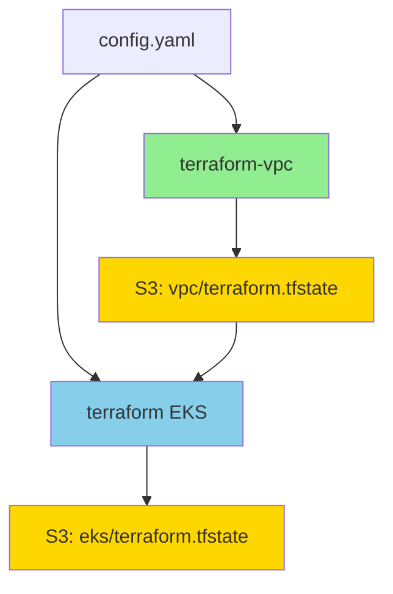

# Terraform VPC Separation - Implementation Summary

## Overview

A infraestrutura Terraform foi refatorada para separar a VPC do cluster EKS, melhorando a modularidade e o gerenciamento do ciclo de vida dos recursos.

## Estrutura Anterior

```
cluster/terraform/
  ├── main.tf (VPC + EKS juntos)
  ├── locals.tf
  ├── outputs.tf
  └── ...
```

**Backend S3:**
- Path único: `cluster-state/terraform.tfstate`

## Estrutura Nova

```
cluster/
  ├── terraform-vpc/          # ← NOVO: VPC isolada
  │   ├── main.tf
  │   ├── locals.tf
  │   ├── outputs.tf
  │   ├── providers.tf
  │   ├── versions.tf
  │   └── README.md
  │
  └── terraform/              # EKS cluster
      ├── main.tf (usa remote state da VPC)
      ├── locals.tf (sem variáveis de VPC)
      ├── outputs.tf
      └── ...
```

**Backend S3 (mesmo bucket, paths diferentes):**
- VPC: `s3://poc-idp-tfstate/vpc/terraform.tfstate`
- EKS: `s3://poc-idp-tfstate/eks/terraform.tfstate`

## Mudanças Implementadas

### 1. Novo Módulo VPC (`cluster/terraform-vpc/`)

**Arquivos criados:**
- `versions.tf` - Versões do Terraform e providers
- `providers.tf` - Provider AWS
- `locals.tf` - Configuração lida do `config.yaml`
- `main.tf` - Módulo VPC (movido do EKS)
- `outputs.tf` - Outputs da VPC (consumidos pelo EKS)
- `README.md` - Documentação completa

**Backend:**
```hcl
backend "s3" {
  bucket = "poc-idp-tfstate"
  key    = "vpc/terraform.tfstate"  # ← Path da VPC
  region = "us-east-1"
}
```

### 2. Atualização do Módulo EKS (`cluster/terraform/`)

**Mudanças em `main.tf`:**
```hcl
# ANTES
module "vpc" {
  source = "terraform-aws-modules/vpc/aws"
  # ... configuração VPC
}

# DEPOIS
data "terraform_remote_state" "vpc" {
  backend = "s3"
  config = {
    bucket = local.terraform_state_bucket
    key    = "vpc/terraform.tfstate"  # ← Lê state da VPC
    region = local.region
  }
}

# Uso
vpc_id     = data.terraform_remote_state.vpc.outputs.vpc_id
subnet_ids = data.terraform_remote_state.vpc.outputs.private_subnets
```

**Mudanças em `locals.tf`:**
- Removidas variáveis de VPC (`vpc_config`, `create_vpc`, `vpc_cidr`, `azs`, `nat_gateway_single`)
- Mantidas apenas variáveis relacionadas ao EKS

**Arquivos atualizados:**
- `main.tf` - Remote state da VPC
- `locals.tf` - Removidas variáveis de VPC
- `karpenter.tf` - Usa `data.terraform_remote_state.vpc.outputs.private_subnets`
- `nlb.tf` - Usa `data.terraform_remote_state.vpc.outputs.*`
- `security_groups.tf` - Usa `data.terraform_remote_state.vpc.outputs.*`

### 3. Scripts de Instalação/Destruição

**`scripts/install-infra.sh` (reescrito):**
```bash
# Step 1: Provision VPC
cd cluster/terraform-vpc
terraform init -backend-config="key=vpc/terraform.tfstate"
terraform apply

# Step 2: Provision EKS (lê VPC via remote state)
cd cluster/terraform
terraform init -backend-config="key=eks/terraform.tfstate"
terraform apply
```

**`scripts/destroy-cluster.sh` (reescrito):**
```bash
# Step 1: Remove ArgoCD apps
# Step 2: Remove namespaces
# Step 3: Destroy EKS cluster
cd cluster/terraform
terraform destroy

# Step 4: Destroy VPC
cd cluster/terraform-vpc
terraform destroy
```

## Fluxo de Dados



## Benefícios

### 1. Ciclo de Vida Independente
- VPC pode ser criada/destruída independentemente do EKS
- Útil para testes e desenvolvimento

### 2. Iterações Mais Rápidas
- Mudanças no EKS não requerem recriação da VPC
- `terraform apply` mais rápido no EKS

### 3. Melhor Organização
- Separação clara entre networking (VPC) e compute (EKS)
- Código mais fácil de entender e manter

### 4. Reutilização Futura
- VPC pode ser compartilhada entre múltiplos clusters
- Base para arquitetura multi-cluster

### 5. Destroys Mais Seguros
- Destruir EKS não destrói acidentalmente a VPC
- Ordem de destruição explícita e controlada

## Outputs da VPC Consumidos pelo EKS

| Output | Uso no EKS |
|--------|-----------|
| `vpc_id` | EKS cluster, security groups, NLB |
| `vpc_cidr_block` | Security group rules (NodePort) |
| `private_subnets` | EKS nodes, Karpenter bootstrap |
| `public_subnets` | NLB (Internet-facing) |
| `nat_gateway_ids` | Referência (não usado atualmente) |
| `igw_id` | Referência (não usado atualmente) |
| `azs` | Informação (não usado atualmente) |

## Compatibilidade com config.yaml

Nenhuma mudança necessária no `config.yaml`. A configuração da VPC continua a mesma:

```yaml
vpc:
  mode: "create"
  cidr: "10.0.0.0/16"
  availability_zones: 3
  nat_gateway_mode: "single"
```

## Comandos de Uso

### Instalação Completa
```bash
make install
```

### Destruição Completa
```bash
make clean
# ou
./scripts/destroy-cluster.sh
```

### Apenas VPC (manual)
```bash
cd cluster/terraform-vpc
terraform init \
  -backend-config="bucket=poc-idp-tfstate" \
  -backend-config="key=vpc/terraform.tfstate" \
  -backend-config="region=us-east-1"
terraform apply
```

### Apenas EKS (manual)
```bash
cd cluster/terraform
terraform init \
  -backend-config="bucket=poc-idp-tfstate" \
  -backend-config="key=eks/terraform.tfstate" \
  -backend-config="region=us-east-1"
terraform apply
```

## Validação

### Verificar States no S3
```bash
aws s3 ls s3://poc-idp-tfstate/vpc/
aws s3 ls s3://poc-idp-tfstate/eks/
```

### Verificar Outputs da VPC
```bash
cd cluster/terraform-vpc
terraform output
```

### Verificar Remote State no EKS
```bash
cd cluster/terraform
terraform console
> data.terraform_remote_state.vpc.outputs.vpc_id
```

## Troubleshooting

### Erro: "No remote state found"
**Causa:** VPC não foi provisionada antes do EKS

**Solução:**
```bash
cd cluster/terraform-vpc
terraform init -backend-config="key=vpc/terraform.tfstate"
terraform apply
```

### Erro: "VPC already exists"
**Causa:** VPC já existe de instalação anterior

**Solução:**
```bash
# Importar VPC existente
cd cluster/terraform-vpc
terraform import module.vpc.aws_vpc.this[0] vpc-xxxxx
```

### Erro: "Backend configuration changed"
**Causa:** Path do backend mudou

**Solução:**
```bash
# Reinicializar com novo backend
terraform init -reconfigure \
  -backend-config="key=vpc/terraform.tfstate"
```

## Migração de Instalações Antigas

Se você tem uma instalação com VPC e EKS no mesmo state:

### Opção 1: Destroy e Recreate (Recomendado)
```bash
make clean  # Destroy tudo
make install  # Recreate com nova estrutura
```

### Opção 2: State Migration (Avançado)
```bash
# 1. Backup do state atual
aws s3 cp s3://poc-idp-tfstate/cluster-state/terraform.tfstate backup.tfstate

# 2. Extrair recursos da VPC
terraform state mv module.vpc terraform-vpc/module.vpc

# 3. Mover state da VPC
aws s3 cp terraform.tfstate s3://poc-idp-tfstate/vpc/terraform.tfstate

# 4. Atualizar EKS para usar remote state
cd cluster/terraform
terraform init -reconfigure -backend-config="key=eks/terraform.tfstate"
```

## Próximos Passos

1. ✅ Separação VPC/EKS implementada
2. ⏭️ Testar instalação completa (`make install`)
3. ⏭️ Testar destruição completa (`make clean`)
4. ⏭️ Atualizar documentação principal (README.md)
5. ⏭️ Considerar separação de outros recursos (RDS, ECR, etc.)

## Referências

- [Terraform Remote State](https://www.terraform.io/language/state/remote-state-data)
- [Terraform S3 Backend](https://www.terraform.io/language/settings/backends/s3)
- [AWS VPC Module](https://registry.terraform.io/modules/terraform-aws-modules/vpc/aws/latest)
