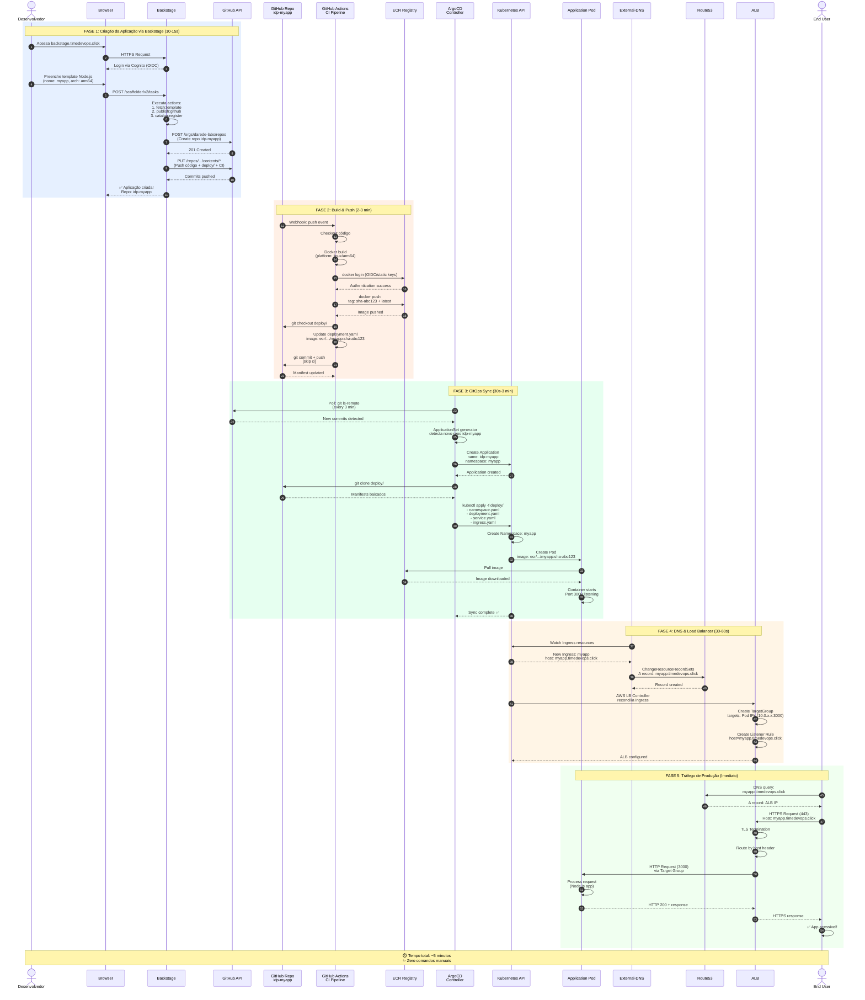
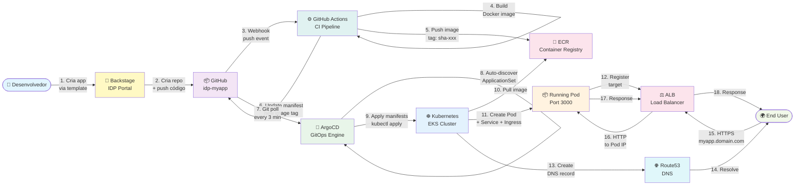

# Fluxo End-to-End - Da Criação à Produção

Este documento mostra o fluxo completo de um desenvolvedor criando uma aplicação no Backstage até ela estar rodando em produção, acessível pela internet.

## Visão Geral

**Tempo Total:** ~5 minutos  
**Comandos Manuais:** 0 (zero)  
**Interação do Dev:** Apenas preencher formulário no Backstage

---

## Diagrama de Sequência Detalhado



---

## Diagrama Simplificado (para apresentações)



---

## Timeline Detalhado

| Fase | Duração | Componentes Envolvidos | O Que Acontece |
|------|---------|------------------------|----------------|
| **1. Backstage Scaffolder** | 10-15s | Backstage → GitHub API | • Dev preenche formulário<br/>• Backstage gera código do template<br/>• Cria repo no GitHub<br/>• Push inicial com código + manifests K8s + CI workflow |
| **2. CI Build & Push** | 2-3 min | GitHub Actions → ECR | • Webhook dispara CI<br/>• Docker build multi-platform (arm64)<br/>• Push para ECR com tags (sha + latest)<br/>• Update deployment.yaml com nova image tag |
| **3. ArgoCD Sync** | 30s-3 min | ArgoCD → Kubernetes | • ArgoCD polling detecta novo repo<br/>• ApplicationSet gera Application<br/>• Cria namespace<br/>• Apply manifests (Deployment, Service, Ingress) |
| **4. DNS & ALB** | 30-60s | External-DNS, LB Controller → Route53, ALB | • External-DNS cria registro A no Route53<br/>• LB Controller cria TargetGroup no ALB<br/>• Health checks começam |
| **5. Ready** | Imediato | - | • App acessível via HTTPS<br/>• ALB target healthy<br/>• DNS propagado |

**Total:** ~5 minutos ⏱️

---

## Protocolos e APIs Utilizados

### Por Fase

**Fase 1 - Backstage:**
- HTTPS: Browser ↔ Backstage (443)
- HTTPS: Backstage ↔ GitHub REST API (443)
- OIDC: Backstage ↔ Cognito (OAuth2 flow)

**Fase 2 - CI/CD:**
- Git over HTTPS: GitHub Actions ↔ GitHub (443)
- Docker Registry API: CI ↔ ECR (443)
- AWS STS: CI ↔ AWS (OIDC authentication)

**Fase 3 - GitOps:**
- Git over HTTPS: ArgoCD ↔ GitHub (443)
- Kubernetes API: ArgoCD ↔ EKS (6443)
- Docker Registry API: Kubelet ↔ ECR (443)

**Fase 4 - Infraestrutura:**
- Kubernetes API: External-DNS, LB Controller ↔ EKS (6443)
- Route53 API: External-DNS ↔ AWS (443)
- ELBv2 API: LB Controller ↔ AWS (443)

**Fase 5 - Tráfego:**
- DNS: End User ↔ Route53 (53)
- HTTPS: End User ↔ ALB (443)
- HTTP: ALB ↔ Pod (3000, interno VPC)

---

## Componentes e Responsabilidades

| Componente | Responsabilidade | Tecnologia |
|------------|------------------|------------|
| **Backstage** | IDP Portal, scaffolding de apps | Node.js, React |
| **GitHub** | Source control, webhooks | Git, REST API |
| **GitHub Actions** | CI/CD pipeline | YAML workflows |
| **ECR** | Container registry | Docker Registry API v2 |
| **ArgoCD** | GitOps engine, auto-sync | Go, Kubernetes controllers |
| **Kubernetes** | Orchestration, scheduling | K8s API server |
| **External-DNS** | DNS automation | Go, Route53 API |
| **AWS LB Controller** | ALB/NLB automation | Go, ELBv2 API |
| **Route53** | DNS resolution | AWS managed |
| **ALB** | Load balancing, TLS termination | AWS managed |

---

## Exemplo Prático

### Input (Desenvolvedor no Backstage)

```yaml
App Name: myapp
Description: My awesome application
Architecture: arm64
Expose Publicly: Yes
Replicas: 2
```

### Output (5 minutos depois)

```bash
# 1. Repo criado
https://github.com/darede-labs/idp-myapp

# 2. Image no ECR
948881762705.dkr.ecr.us-east-1.amazonaws.com/idp-myapp:sha-abc123

# 3. Namespace + Pods no Kubernetes
$ kubectl get pods -n myapp
NAME                     READY   STATUS    RESTARTS   AGE
myapp-7d4f8b9c5d-abc12   1/1     Running   0          2m
myapp-7d4f8b9c5d-def34   1/1     Running   0          2m

# 4. DNS configurado
$ dig myapp.timedevops.click +short
1.2.3.4  # ALB IP

# 5. App acessível
$ curl -I https://myapp.timedevops.click
HTTP/2 200
content-type: application/json
```

---

## Observabilidade do Fluxo

Durante o fluxo, você pode acompanhar o progresso:

### No Backstage
```
Tasks → View running task → Ver logs em tempo real
```

### No GitHub
```
Actions → CI workflow → Build & Push logs
```

### No ArgoCD
```
Applications → idp-myapp → Sync status
```

### No Kubernetes
```bash
kubectl get application idp-myapp -n argocd -w
kubectl get pods -n myapp -w
```

---

## Comparação: Antes vs Depois da IDP

| Aspecto | Antes (Manual) | Depois (IDP) | Melhoria |
|---------|----------------|--------------|----------|
| **Criar repo** | Manual no GitHub | Automático | Instantâneo |
| **Criar Dockerfile** | Copiar de outro projeto | Template gerado | 100% padronizado |
| **Setup CI/CD** | Criar workflow do zero | Template gerado | 100% padronizado |
| **Criar manifests K8s** | Escrever YAML manual | Template gerado | 100% padronizado |
| **Deploy inicial** | kubectl apply manual | ArgoCD auto-sync | Zero comandos |
| **Setup DNS** | Abrir ticket infra | Automático via External-DNS | Sem tickets |
| **Setup ALB** | Console AWS manual | Automático via LB Controller | Sem console |
| **Observabilidade** | Configurar manualmente | Pré-configurado no template | Integrado |
| **Tempo Total** | 2-3 dias | 5 minutos | **99.8% redução** |
| **Comandos Manuais** | 20-30 comandos | 0 comandos | **100% redução** |
| **Taxa de Erro** | ~20% (typos, esquecimentos) | ~0% | **100% redução** |

---

## Rollback e Recovery

Se algo der errado, o rollback é simples:

```bash
# Rollback via Git (ArgoCD auto-sync)
cd idp-myapp
git revert HEAD
git push

# ArgoCD detecta e faz rollback automático em ~3 min
```

Ou via ArgoCD UI:
```
Application → History → Rollback to revision X
```

---

## Segurança no Fluxo

Cada etapa tem controles de segurança:

1. **Backstage:** Cognito OIDC, RBAC por grupos
2. **GitHub:** Token auth com scopes limitados
3. **CI:** OIDC (sem credenciais estáticas), ECR private registry
4. **ArgoCD:** RBAC, AppProject restrictions, namespace isolation
5. **Kubernetes:** NetworkPolicies, PodSecurityStandards, IRSA
6. **ALB:** TLS termination, WAF (opcional), Security Groups
7. **Pods:** Non-root user, read-only filesystem, resource limits

---

## Monitoramento do Fluxo

Você pode monitorar cada etapa:

```bash
# Backstage tasks
kubectl logs -n backstage -l app.kubernetes.io/name=backstage -f

# CI logs
# Ver no GitHub Actions UI

# ArgoCD sync
argocd app get idp-myapp --refresh

# Kubernetes events
kubectl get events -n myapp --sort-by='.lastTimestamp'

# Pod logs
kubectl logs -n myapp -l app.kubernetes.io/name=myapp -f
```

---

## FAQ

**P: E se o build do CI falhar?**  
R: ArgoCD não cria a Application pois o repo não tem deploy/ com manifests válidos. Dev conserta e faz novo push.

**P: E se o ArgoCD não detectar o repo?**  
R: Verifica se o repo nome começa com `idp-` e tem diretório `deploy/`. ApplicationSet filter requer ambos.

**P: E se o DNS não propagar?**  
R: External-DNS cria o registro em ~30s. Propagação DNS pode levar 1-2 min. Verificar logs do External-DNS.

**P: E se o pod não subir?**  
R: ArgoCD mostra o erro no status. Verificar: image pull (ECR permissions), resources (limits), probes (readiness).

**P: Posso customizar o template?**  
R: Sim! Templates estão em `backstage-custom/templates/`. Edite e commit para atualizar.

---

**Última Atualização:** 2026-01-29  
**Autor:** Platform Team
